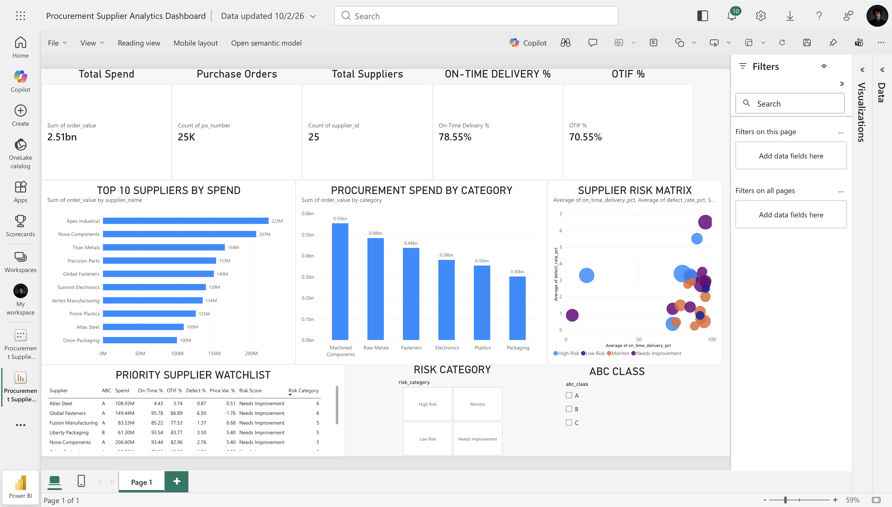

# Procurement & Supplier Performance Analytics

An end-to-end procurement analytics project using **SQL, Python, Excel, and Power BI** to analyze supplier performance, procurement spend, delivery reliability, quality, pricing variance, and sourcing risk.

## Business Problem

A manufacturing organization purchases materials and components from a network of domestic and international suppliers.

Procurement leadership needs visibility into:

- Supplier spend concentration
- On-time delivery performance
- OTIF performance
- Supplier quality
- Purchase price variance
- Supplier risk
- Potential sourcing and cost-saving opportunities

The objective is to transform transactional procurement data into actionable supplier-management insights.

---

## Dataset

The project analyzes:

- **25,000 purchase orders**
- **25 suppliers**
- **6 procurement categories**
- **3 manufacturing plants**
- Approximately **$2.51B in procurement spend**

The dataset was programmatically generated in Python to simulate realistic procurement transactions and supplier behavior.

---

## Tools & Technologies

- **Python**
- **Pandas**
- **NumPy**
- **SQL / SQLite**
- **Excel**
- **Power BI**
- **GitHub**

---

## Key Procurement KPIs

| KPI | Result |
|---|---:|
| Total Procurement Spend | ~$2.51B |
| Purchase Orders | 25,000 |
| Suppliers | 25 |
| On-Time Delivery | 78.55% |
| OTIF | 70.55% |

---

## Supplier Analysis

The analysis evaluates suppliers using:

- Total procurement spend
- Spend share
- ABC classification
- On-time delivery %
- Fill rate %
- OTIF %
- Defect rate %
- Purchase price variance %
- Lead time
- Supplier risk classification

---

## Key Findings

### Delivery Risk

**Titan Metals** and **Atlas Steel** showed significant delivery-performance concerns and require supplier corrective-action or alternate-sourcing evaluation.

### Quality Risk

**Global Fasteners** showed one of the highest defect rates among major suppliers.

**Pioneer Metals** also demonstrated elevated quality risk despite comparatively better delivery performance.

### Commercial Risk

**Summit Electronics** showed significant positive purchase-price variance, indicating an opportunity for supplier negotiation, should-cost analysis, or competitive sourcing.

### Strategic Spend Exposure

**Apex Industrial** represents one of the largest procurement-spend exposures in the supplier base. Because of its financial importance, even moderate performance issues can materially affect operations.

---

## Power BI Dashboard

The dashboard provides an executive view of:

- Procurement spend
- Purchase order volume
- Supplier count
- On-time delivery
- OTIF
- Top suppliers by spend
- Spend by category
- Supplier risk matrix
- Priority supplier watchlist
- ABC supplier classification
- Risk-category filtering



---

## SQL Analysis

The repository contains standalone SQL scripts for:

1. Data-quality validation
2. Procurement-spend analysis
3. Supplier-performance KPIs
4. ABC / Pareto supplier analysis

---

## Repository Structure

```text
procurement-supplier-analytics/
│
├── README.md
├── data/
│   └── raw/
│       └── procurement_transactions.csv
│
├── notebooks/
│   ├── procurement_dataset_generator.ipynb
│   └── procurement_sql_analysis.ipynb
│
├── sql/
│   ├── 01_data_quality.sql
│   ├── 02_spend_analysis.sql
│   ├── 03_supplier_performance.sql
│   └── 04_abc_analysis.sql
│
└── dashboard/
    └── screenshots/
        └── procurement_supplier_dashboard.png
